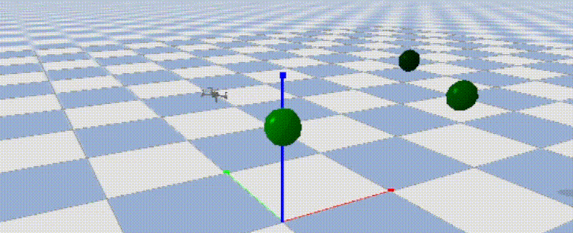
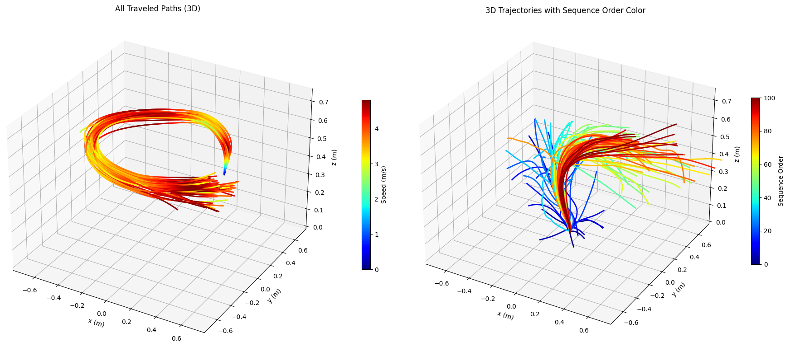

# Deep Reinforcement Learning Simulator and Algorithms for optimal pathfinding

### Working model based on SB3 and pybullet-drones with strictly positional observations

<p align="center">
  
</p>

---

### 1. Introduction

#### Project Goal

Autonomous navigation of drones is a challenging problem that is yet to be  fully solved.
It requires the development of efficient algorithms for planning,
control and intelligent decision-making against unexpected observations. 
Deep reinforcement learning (DRL) has shown promise in solving these problems,
but it is still an open question how to best apply it.

The project's original goal was to develop a DRL-based framework for autonomous drone racing,
but the same model could be utilized for other, more relevant real-world scenarios,
such as search and rescue, surveillance and package delivery.

#### Project Description

The Environment Simulator is designed to be lightweight, flexible and modular, built on the pybullet-drones library, with the RL algorithms mainly borrowed from the Stable-Baselines3 library.

The focus was put on Proximal Policy Optimization (PPO) and Soft Actor-Critic (SAC).
A variety of different settings of hyperparameter combination were evaluated on performance and speed,
visualized in different ways. 

Furthermore, novel and other literature-based reward functions were implemented and tested.

---

### 2. Requirements
To install dependencies in a Conda, miniconda or Poetry environment:

```
$ pip install -r requirements.txt
```

Adding path might help:    $env:PYTHONPATH = "...\RL"


To install PyTorch on Windows or Linux with CUDA 11.8 for GPU support:
```
$ conda install pytorch torchvision torchaudio pytorch-cuda=11.8 -c pytorch -c nvidia
```
To install TensorFlow with GPU support (not need for main algorithm):
```
conda install -c conda-forge cudatoolkit=11.2 cudnn=8.1.0

# Anything above 2.10 is not supported on the GPU on Windows Native
python -m pip install "tensorflow<2.11"

# Verify the installation:
python -c "import tensorflow as tf; print(tf.config.list_physical_devices('GPU'))"
```

The CleanRL and RLLib implementations also need to be installed separately.

Also included is a uv.lock file. 

---

### 3. Basic operation

First, the simulation_controller reads in the args, initializes the targets (the Waypoints class), 
then starts the chosen function of the PBDroneSimulator class that controls
the whole learning or testing process.

---

### 4. Example


Accessing tensorboard logs:
```
tensorboard --logdir ./Sol/logs/
```

Example args for a full training process on Windows (using gui significantly slows learning):

```
$ python Sol/Model/simulation_controller.py --agent PPO --run_type full  --wandb f --savemodel t --gui f --norm_rew f --lib sb3 --num_envs 12 
``` 
For Ubuntu:
```
python3 ./Sol/Model/simulation_controller.py --agent PPO --run_type full --wandb f
``` 

For Ubuntu with WSL:
```
 python3 Sol/Model/simulation_controller.py --agent PPO --run_type full --wandb False --savemodel False
 ```
On root installation for activating the example conda environment:
```
 source activate  /root/miniconda3/envs/RL-WSL
```


### Success models

Loads and tests a preselected model. 
All models are saved in the model_chkpts folder. 
I sampled a few good policies in the function.

Might need to tweak the observation (and action) spaces prior to launching.


```
$  python Sol/Model/simulation_controller.py --agent PPO --run_type saved  --wandb f  
``` 


### Utilities
I implemented a few functions for tf.events manipulation which visualizes the training process according 
to selected metrics.
   
    python Sol/Utilities/TensorBoardManager.py   

Trajectory visualizations from collected data during a full training process.
(requires collecting a vast number of episodes).

    python Sol/Utilities/TrajectoryVisualizer.py  

Value function regression with other methods (requires collecting rollouts):

    python Sol/Model/Policies/alt_methods.py

---

### 5. Results

I optimized the learning environment and fine-tuned the PPO hyperparameters.
It turned out to be an effective solution for the drone navigation problem, but with a few assumptions.
The PPO agent learns to navigate through the waypoints in about 4 hours of training on a low-spec machine.




Although not with perfectly fine-tuned hyperparameters,
SAC manages to learn a circle track in about 15 hours of training. 

---

### 6. Notes

- The OpenGl 3 engine does not work in virtual machines, so in order to have a visual representation of the simulation,
it is necessary to run the simulation with OpenGL 2, set in the modified BaseAviary class, as such: 
```
p.connect(p.GUI, options="--opengl2")
```
Further: only OpenGL3 works in Windows. Using Ubuntu Virtual Machine this stackoverflow article might be useful: 
https://askubuntu.com/questions/1352158/libgl-error-failed-to-load-drivers-iris-and-swrast-in-ubuntu-20-04

- On Ubuntu, with an NVIDIA graphics card, if encountered a "Failed to create and OpenGL context" message, launch nvidia-settings 
with "Performance Mode PRIME Profile," reboot and try again.

- StableBaselines3 and other packages that have '_' in them might not be installed or recognized correctly.

- On Windows, it is required to install C++ build tools, Windows 10/11 SDK , and the CMake tools for Visual Studio.

---

### 7. Future Improvements

1. Frame skipping.
2. Added noise test to ease the sim-to-real transfer.
