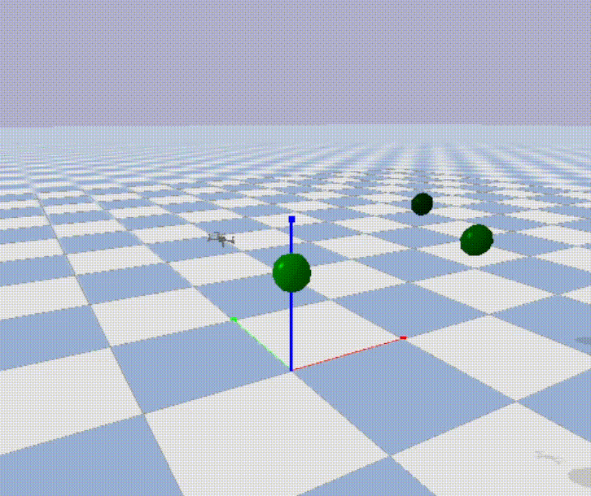

# Deep reinforcement learning Simulator and Algorithm environment for optimal path finding

### Based on Stable-Baseline3 and PyBullet-drones, for PPO and SAC


### 1. Introduction

The autonomous navigation of drones is a challenging problem that is yet to be solved.
It requires the development of efficient algorithms for path planning,
control and intelligent decision-making when unexpected events occur. 
Deep reinforcement learning (DRL) has shown promise in solving these problems,
but it is still an open question how to best apply it.

My original goal with this project was to develop a DRL-based framework for autonomous drone racing, 
but this same model could be utilized for other, perhaps more relevant real-world scenarios, 
such as search and rescue, surveillance and package delivery.

The simulator is based on the PyBullet-drones environment, 
and the algorithms are used from the Stable-Baselines3 library. 
I also have used Tensorflow's TF-Agents library, the OpenAI Gym library, and run tests using AirSim.
I focus on the Proximal Policy Optimization (PPO) and Soft Actor-Critic (SAC) algorithms, 
which are optimized for continuous control tasks. 
I evaluate the performance of the algorithms with a variety of differing hyperparameters.

### 2. Requirements
To install dependencies in a Conda, miniconda or Poetry environment:

```
$ pip install -r requirements.txt
```

Adding path might help:    $env:PYTHONPATH = "...\RL"


To install PyTorch on Windows or Linux with CUDA 11.8 for GPU support:
```
$ conda install pytorch torchvision torchaudio pytorch-cuda=11.8 -c pytorch -c nvidia
```
To install TensorFlow with GPU support (not need for main algorithm):
```
conda install -c conda-forge cudatoolkit=11.2 cudnn=8.1.0

# Anything above 2.10 is not supported on the GPU on Windows Native
python -m pip install "tensorflow<2.11"

# Verify the installation:
python -c "import tensorflow as tf; print(tf.config.list_physical_devices('GPU'))"
```

The CleanRL and RLLib implementations also need to be installed separately.
.


### 3. Example
Example args for Windows:

```
$ python Sol/Model/simulation_controller.py --agent PPO --run_type full  --wandb f --savemodel t --gui f --norm_rew f --lib sb3 --num_envs 12 
``` 
For Ubuntu:
```
python3 ./Sol/Model/simulation_controller.py --agent PPO --run_type full --wandb f
``` 

For Ubuntu with WSL:
```
 python3 Sol/Model/simulation_controller.py --agent PPO --run_type full --wandb False --savemodel False
 ```
On root installation for activating the conda environment:
```
 source activate  /root/miniconda3/envs/RL-WSL
```

### 4. Basic opertion

First, the simulation_controller parses the args, initializes the targets (Waypoints), 
then starts the chosen function of the PBDroneSimulator class that direct the whole learning process.

### Utilities
tf.events manipulation:
   
    python Sol/Utilities/TensorBoardManager.py   

Value function regression with other methods (requires collecting rollouts):

    python Sol/Model/Policies/alt_methods.py    

### 5. Results

I optimized the learning environment and fine-tuned the PPO algorithm's hyperparameters so that 
PPO has shown to be an effective solution for the drone navigation problem.
The PPO agent learns to navigate through the waypoints in about 4 hours of training on a low-spec machine.



Without fine tuned hyperparameters SAC only manages to learn to track in 15 hours of training. 

### 6. Notes

The OpenGl 3 engine doesn't work in virtual machines, so in order to have a visual representation of the simulation,
it is necessary to run the simulation with OpenGL 2, set in the modified BaseAviary class, as such: 
```
p.connect(p.GUI, options="--opengl2")
```
Further: only OpenGL3 works in turn in Windows.
Using Ubuntu Virtual Machine this stackoverflow article might be useful: 
https://askubuntu.com/questions/1352158/libgl-error-failed-to-load-drivers-iris-and-swrast-in-ubuntu-20-04

On Ubuntu, with an NVIDIA card, if you receive a "Failed to create and OpenGL context" message, launch nvidia-settings 
and under "PRIME Profiles" select "NVIDIA (Performance Mode)", reboot and try again.


StableBaselines3 and other packages that have '_' in them might not be installed or recognized correctly.


### 7. To Do

Further algorithmic speed and data efficiency improvements. 

Specific dir for the conda environment.

SAC.

1. Frame skipping
2. Deeper networks
3. MLP sharing effects
4. Testing for added noise


